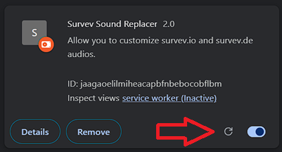
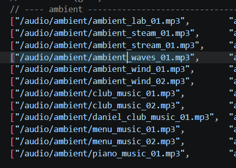

# survev-sound-replacer
This is an extension to replace existed sounds in both survev.io and survev.de games. The extension WILL NOT replace any sounds until you replace the default game assets with your asset, or change the `TO PATH` in `background.json`

# credit
The code was originally created by `HumphreyGaming`, `Tungsten Hexafluoride`, `brzsmg`, and `IceHacks` and is modified by `Furaken` to work properly on survev.de.
Thanks Yunaka for their custom assets.

# installation
1. Download the repo as ZIP: [link](https://github.com/Furaken/survev-sound-replacer/archive/refs/heads/main.zip)
2. Unpack the ZIP file
3. Go to your browser's extension page (ask google if you are lost), then turn on the `Developer mode`
4. Press `Load unpacked` button then select and upload the unpacked folder. OR you can just drag & drop the unpacked folder to the page

Note: Remember to press the reload button the update the extension if you have made any changes

# how do i know how an url sounds like?
In the `background.js` file, there are a lot of game audio urls, they are both combined from surviv.io and survev.de. To open it and hear the actual sounds, combine the game url with the path. For example, to know how `ambient_waves_01` sounds like, simply just combine the game url with the path from the left (`FROM PATH`): [link](https://survev.io/audio/ambient/ambient_waves_01.mp3)

# other-assets
There are some premade assets by others. To apply that asset, move or copy the asset folder to the path where default asset (`audio`) lives, then rename it to `audio`. Remember to rename the default `audio` asset to something else (e.g. `default_asset`) before doing that.
